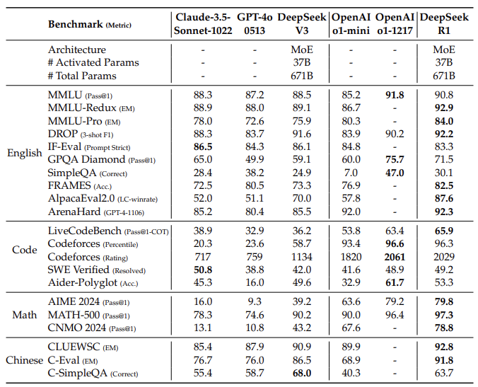
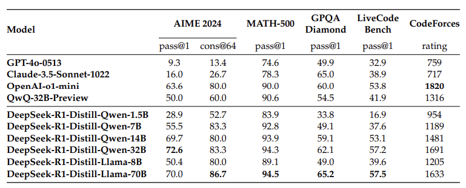
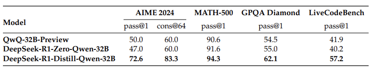

This article is to introduce DeepSeek-R1-Zero and DeepSeek-R1. The former is a model trained through large-scale reinforcement learning without supervised fine-tuning; the latter is an improved version of such model through multi-stage training and cold-start data from reinformance learning process. DeepSeek-R1 is expected to further compete with existing language models offered by other research centers.

<h3>DeepSeek-R1-Zero</h3>

The importance of this model lies onthe fact that supervised data is not used **at all**.

The algorithm that has been applied is Group Relative Policy Optimization (GRPO). This method go without the critic model that is
normally the identical size as the policy model, and estimates the baseline from group scores instead. For each question $q$, GRPO would generate a group of outputs ${o_1, o_2, ... , o_G}$ from the old policy $\pi_{\theta_{\text{old}}}$, then optimizes the policy model $pi_\theta$.

Another concept that has been applied is reward modeling. There are two types of rewards:

1. Accuracy rewards: to check whether the response is correct.
2. Format rewards: provide thinking process with contents between \<think\> tags.

Another is straight-forward template. This bans content-specific biases.

The result has been promising - the advantages of reinforcement learning could be seen through in-depth self-learning. However, a room for improvement can be found with it showing drawbacks including poor readability and language mixing.

<h3>DeepSeek-R1</h3>

This model is to address two questions from the former model:

1. Can reasoning performance be further improved or converge accelerated by utilizing small amount of high-quality data at the start?
2. How can the model be more user-friendly with more clear chain of thought and general capability?

For the first question, a few approaches have been made:

- Few-Shot learning from DeepSeek-V3-Base model for readability and reducing human error,
- Reinforcement Learning with consistency in language usage and for invoking chain of reasoning with helpfulness for tasks.

In addition, distilled models are fine-tuned with public models like Qwen and Llama only through supervised fine-tuning. Reinforcement Learning is not applied due to the fact that the goal is to demonstrate the effectiveness of distillation technique.

<h3>Result</h3>

The experiment is done with various dependent variables:

- Generation length to 32,768 tokens
- pass@k evaluation and report pass@1 using sampling temperature of 0.6 and top-p value of 0.95 to generate different number of responses (between 4 to 64 depending on the test set size).

The summarized pass@1 score is as follows:

These are the results for distilled models:

To check further the impact of distilled models and reinforcement learning, reinforcement training has been done on Qwen. This is the result for this experiment:

There are two conclusions made through tese experiments:

1. Distilling more powerful models into smaller ones generate excellent results; on the other hand, smaller models with reinforcement learning require enormous computational power and may not be able to show promising results,
2. To further advance to dimension of intelligence, more computational power and strong base models are required.

<h3>Additional Information</h3>

The researchers attempted other methods to improve the model at earlier stages, which include:

- Process Reward Model, which failed for its difficulty in defining fine-grain step in general reasoning, determining the accuracy of specific step in line of reasoning, and its necessity to introduce a new training pipeline after introduction of such a model,
- Monte Carlo Tree Search, which failed due to the fact that language model requires enormous vector space and inability to improve iteratively.

Overall, this paper demonstrates a new paradigm of language model by introducing a whole new training process.

The overall paper can be found [here](https://arxiv.org/pdf/2501.12948v1).
